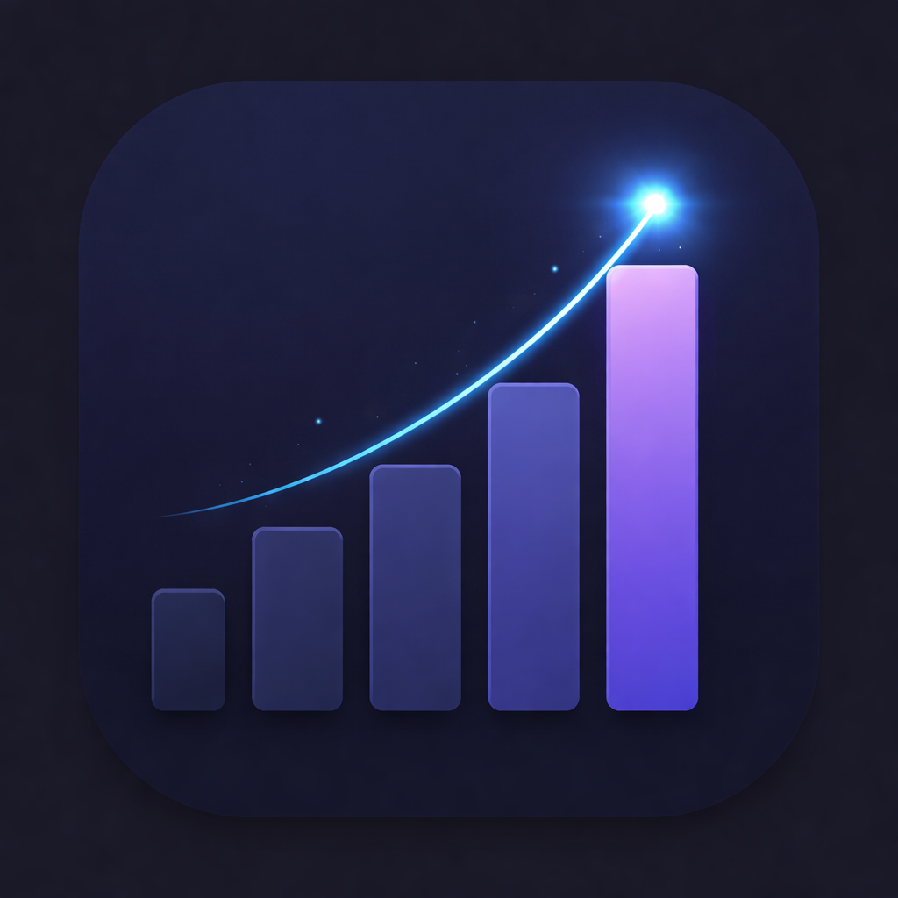
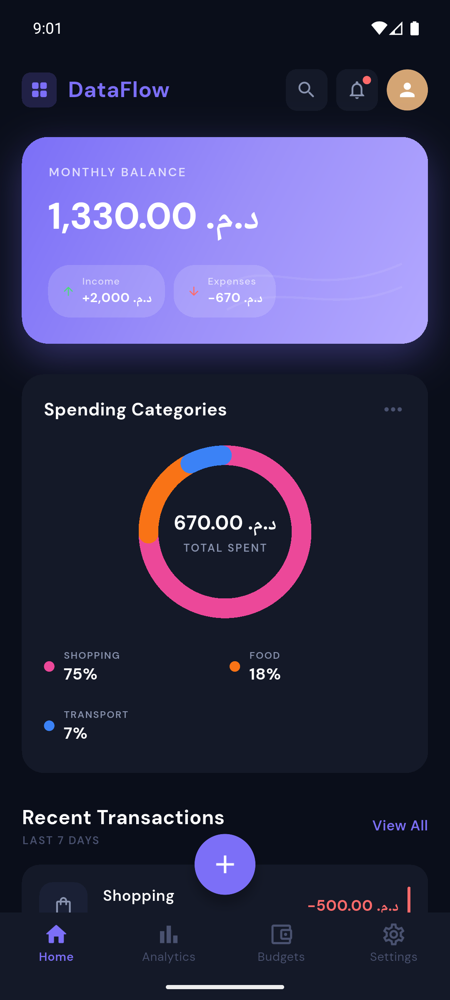
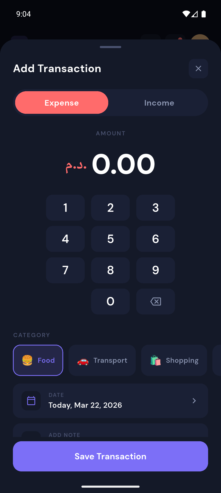
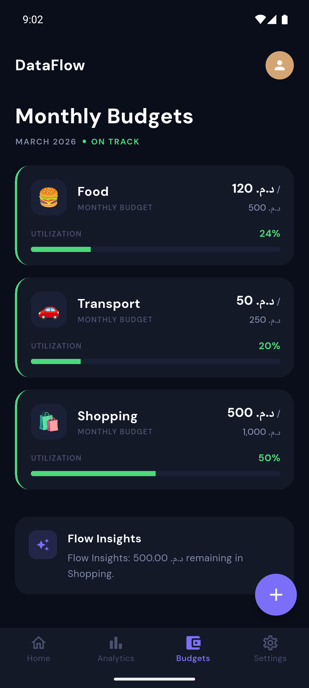
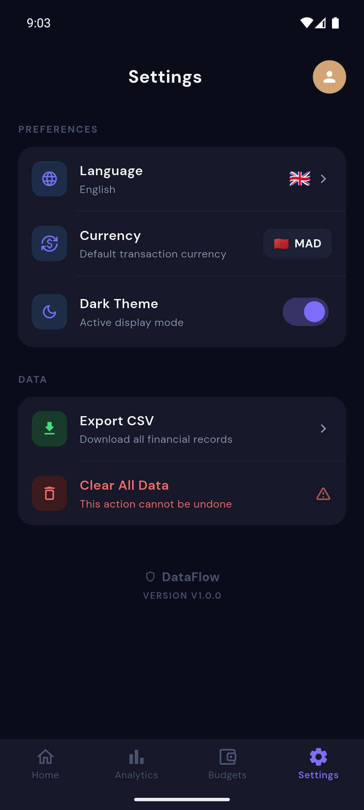

<div align="center">



# DataFlow

### Personal Finance Tracker

**Track expenses · Set budgets · Visualize spending**

[](https://flutter.dev)
[](https://dart.dev)
[](https://pub.dev/packages/hive)
[](LICENSE)
[](https://android.com)

[**Download APK**](https://github.com/YOUR_USERNAME/dataflow/releases/latest) · [**Landing Page**](https://YOUR_USERNAME.github.io/dataflow-landing) · [**Report Bug**](https://github.com/YOUR_USERNAME/dataflow/issues)

</div>

---

## 📱 Screenshots

<div align="center">
<table>
  <tr>
    <td align="center"><b>Dashboard</b></td>
    <td align="center"><b>Add Transaction</b></td>
    <td align="center"><b>Analytics</b></td>
    <td align="center"><b>Budgets</b></td>
    <td align="center"><b>Settings</b></td>
  </tr>
  <tr>
    <td></td>
    <td></td>
    <td></td>
    <td></td>
    <td></td>
  </tr>
</table>
</div>

---

## ✨ Features

| Feature | Description |
|---|---|
| 📊 **Smart Dashboard** | Monthly balance, donut chart by category, recent transactions |
| 💱 **Live Exchange Rates** | Real-time conversion via [open.er-api.com](https://open.er-api.com) — MAD, USD, EUR, GBP, SAR |
| 🎯 **Budget Tracking** | Set monthly budgets per category with visual progress bars and smart alerts |
| 🌍 **Multi-language** | Full support for English, Français, and العربية with RTL layout |
| 🔒 **100% Offline** | All data stored locally with Hive — no account, no server, no risk |
| 📤 **CSV Export** | Export all transactions as CSV and share directly from the app |
| 🔔 **Smart Notifications** | Budget exceeded alerts, weekly spending insights |
| 🔍 **Search** | Search transactions by name, category, or amount |

---

## 🛠️ Tech Stack

```
┌─────────────────────────────────────────────────────────┐
│  UI Layer        Flutter 3.x + Material 3 + DM Sans     │
│  State Mgmt      Provider 6.x                           │
│  Local Storage   Hive 2.x (NoSQL, offline-first)        │
│  Networking      http 1.x (exchange rates only)         │
│  Localization    Flutter Localizations (EN / FR / AR)   │
│  Export          csv + share_plus + path_provider       │
└─────────────────────────────────────────────────────────┘
```

---

## 📁 Project Structure

```
lib/
├── core/
│   ├── l10n/
│   │   └── app_localizations.dart    # EN / FR / AR translations
│   ├── services/
│   │   ├── currency_service.dart     # Live exchange rate API
│   │   └── hive_service.dart         # Hive init + box management
│   └── theme/
│       ├── app_theme.dart            # Material 3 dark/light themes
│       └── app_theme_colors.dart     # Dynamic color helper
├── models/
│   ├── transaction.dart              # Hive model — typeId: 1
│   ├── budget.dart                   # Hive model — typeId: 2
│   └── category_type.dart           # Enum — typeId: 0
├── providers/
│   ├── transaction_provider.dart     # CRUD + aggregations
│   ├── budget_provider.dart          # Budget CRUD + status
│   ├── currency_provider.dart        # Currency + formatting
│   ├── theme_provider.dart           # Dark/light persistence
│   └── locale_provider.dart          # Language persistence
└── screens/
    ├── dashboard/                    # Home + Add Transaction
    ├── analytics/                    # Charts + breakdown
    ├── budgets/                      # Budget cards + FAB
    ├── settings/                     # Preferences + export
    └── shared/                       # Drawer, Search, Notifications
```

---

## 🚀 Getting Started

### Prerequisites

- Flutter SDK `>=3.0.0`
- Dart SDK `>=3.0.0`
- Android Studio / VS Code

### Installation

```bash
# Clone the repository
git clone https://github.com/YOUR_USERNAME/dataflow.git
cd dataflow

# Install dependencies
flutter pub get

# Generate Hive adapters
flutter pub run build_runner build --delete-conflicting-outputs

# Run the app
flutter run
```

### Build Release APK

```bash
flutter build apk --release
# Output: build/app/outputs/flutter-apk/app-release.apk
```

---

## 🌍 Localization

The app supports 3 languages with full RTL layout for Arabic:

| Language | Code | RTL |
|---|---|---|
| English | `en` | ❌ |
| Français | `fr` | ❌ |
| العربية | `ar` | ✅ |

All strings live in `lib/core/l10n/app_localizations.dart`.

---

## 💱 Currency Support

All amounts are stored internally in **MAD (Moroccan Dirham)**.  
At display time, amounts are converted using live rates fetched from:

```
https://open.er-api.com/v6/latest/MAD
```

Rates are cached in Hive and refreshed every **6 hours**.

| Currency | Symbol | Flag |
|---|---|---|
| MAD | د.م. | 🇲🇦 |
| USD | $ | 🇺🇸 |
| EUR | € | 🇪🇺 |
| GBP | £ | 🇬🇧 |
| SAR | ﷼ | 🇸🇦 |

---

## 📦 Dependencies

```yaml
# State & Storage
provider: ^6.1.2
hive: ^2.2.3
hive_flutter: ^1.1.0

# UI & Fonts
google_fonts: ^6.2.1
fl_chart: ^0.68.0

# Utilities
intl: ^0.20.2
uuid: ^4.4.0
http: ^1.2.0
csv: ^6.0.0
share_plus: ^9.0.0
path_provider: ^2.1.3
flutter_localizations:
  sdk: flutter
```

---

## 🗺️ Roadmap

- [ ] iOS support
- [ ] Recurring transactions
- [ ] Transaction categories customization
- [ ] Cloud backup (optional)
- [ ] Widget for home screen
- [ ] Play Store release

---

## 👨‍💻 Author

**Anas Berrqia**

[](https://YOUR_PORTFOLIO_URL)
[](https://linkedin.com/in/YOUR_LINKEDIN)
[](https://github.com/YOUR_USERNAME)

---

## 📄 License

```
MIT License — feel free to use, modify, and distribute.
See LICENSE file for details.
```

<div align="center">

Made with 💙 using Flutter

⭐ Star this repo if you found it useful!

</div>
